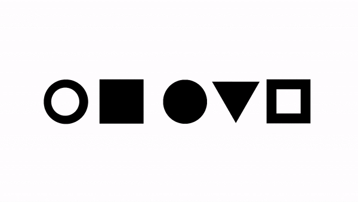
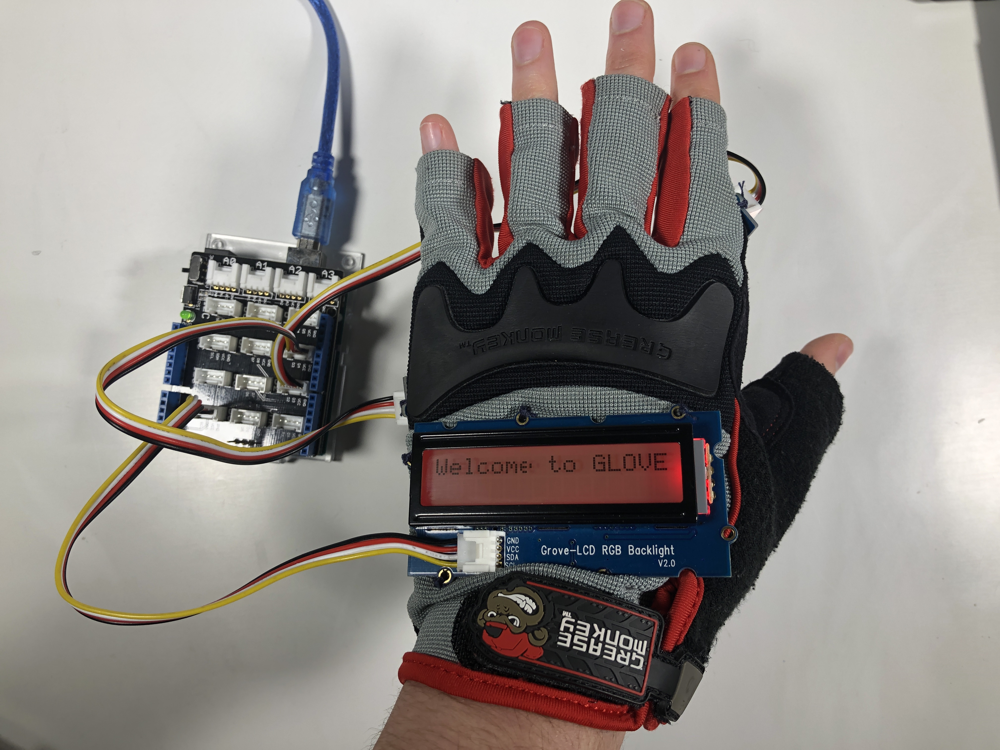
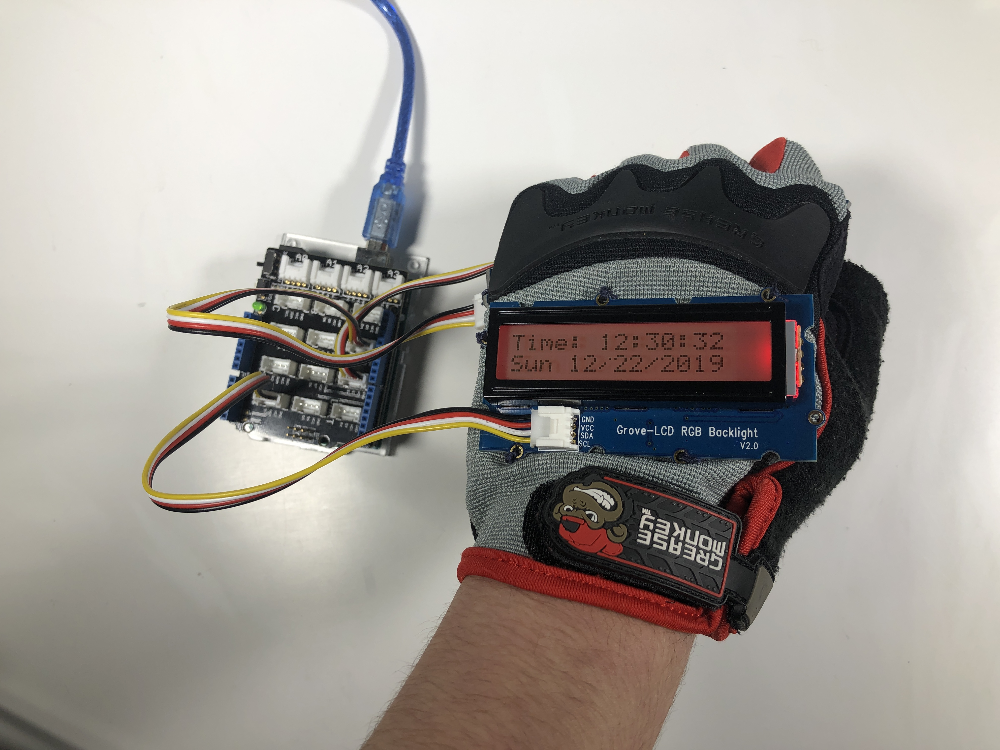
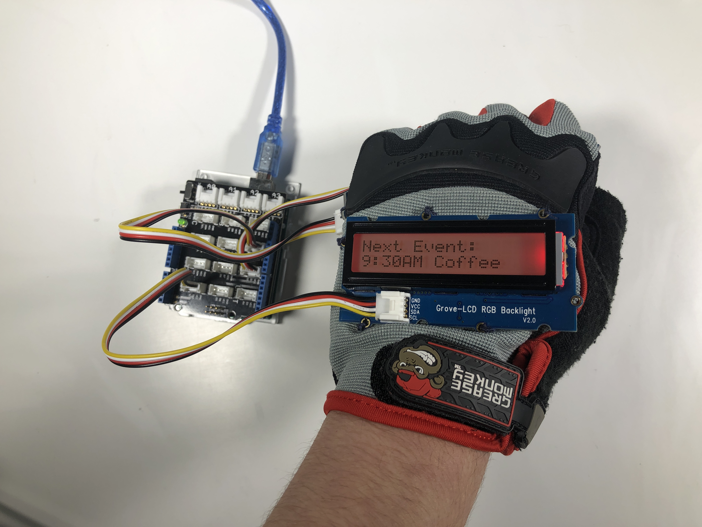

# GLOVE
Experimenting with alternative interface design using an Arduino and a work glove. I created an interactive demo of how a back-of-hand interface could function. 

## LCD Screen Pages

For this project, I used the Grove RGB Backlit LCD Screen and an Arduino Uno to alternate through the different example features of the interface. To switch between pages, I needed to clear the screen and re-print all of the text every half second as a refresh rate. The positioning of the LCD screen worked fine for the demo, but in an future iteration, I would want the screen more towards the person when the hand is in a resting state. This would be located on the lower thumb area, where it attaches to the rest of the hand. 

### Time and Date

An additional part is be needed to display the accurate date and time. This part is called an Real Time Clock and can be added on to the pins of the Arduino. 

### Weather

This feature could be implemented with a wifi connections and a weather API. I did experiement a bit with an Arduino temperature senesor, but this would not be helpful in determining the outside temperature. 

### Messages

Similar to a smartwatch, it could be useful to have notifications appear on the back of the GLOVE. There would be less of a need for a haptic or auditory alert for notifications if they are displayed on the back of the hand, becasuse you would be able to see the screen change if you were typing when the notification occured. 

### Calendar

It could also be beneficial to provide access to the user's calendar to remind them of their upcoming events.

## Menu Navigation

To navigate to a different page, the wearer can use their thumb to tap their pointer finger until they get to the page that they are looking for. This feature works well due to an interrupt and a debouncer that I set for the button. 

## Power Button

To turn off the LCD screen attached to the GLOVE, one must make a fist and bumb the side of their hand to the table. This presses a button that changes the state of the device. It is a very fun and satisfying mechanic to power the device off. 

## Fabrication Method

To adhere the sensors and LCD screen to the glove, I sewed a few loops through the glove and the holes in each board. This method works really well for rapid prototyping as the strings could easily be cut without damaging the glove if I needed to move any of the sensors. I found that sewing through the board at least 3 times was good enough to hold the board in place.

## Materials List

#### Thanks!
Thank you to the Olin College Library for the Grove Arduino kit and the Principles of Engineering course for giving me the confidence to make my own Arduino projects.
